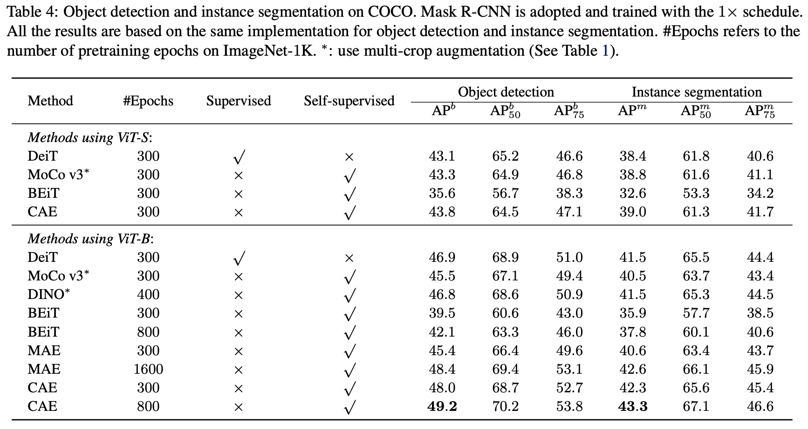

# Context Autoencoder for Self-Supervised Representation Learning

[論文](https://arxiv.org/abs/2202.03026)

## アブストラクト
本論文では自己教師あり学習のための新しいマスク画像モデリング（MIM）アプローチであるコンテキストオートエンコーダ（CAE）を提案します。

BEiTのようにエンコードとデコードの役割を1つのモジュールで行う従来のMIM手法に対して、本手法は、エンコードの役割（内容理解）とデコードの役割（マスクパッチに対する予測）を異なるモジュールで分離し、内容理解の能力を向上させることを試みています。

## イントロダクション
自己教師あり学習のためのマスク画像モデリングタスクを研究しています。
マスク画像モデリング(MIM)は、入力画像のいくつかのパッチをマスクし、可視パッチからマスクパッチに対する予測を行うタスクです。
MIMタスクを解くことで事前に学習したエンコーダは、下流のタスクを解くために必要なセマンティクス（意味や意図）を持ったパッチ表現を抽出することができると期待されます。

BEiTとViT論文で研究された二つのMIM手法は、パッチトークンと画素をそれぞれ予測するために（self-attentionを用いて形成された）ViTを学習し、得られたViTを事前学習エンコーダとして使用します。
これらの方法は、可視パッチとマスクパッチを表すマスクトークンを入力とし、可視パッチとマスクパッチの両方について予測を行い、マスクパッチについてのみの予測は学習中に評価されます。
この2つの方法は、1つのViT構造を符号化と復号化の両方に同時に使用します。
このため、ViTの部分的な容量のみがエンコードと表現学習に利用され、表現品質が制限されます。

本論文では、Fig.1に示すようなコンテキストオートエンコーダ（CAE）により、符号化品質を向上させる手法を提案します。
画像を可視パッチとマスクパッチの2組にランダムに分割します。

エンコーダはViT構造であり、可視パッチのみを入力とし、可視パッチのみについて潜在的な表現を学習します。
Fig.1の一番上の流れのエンコーダは、目に見えるパッチに対してのみ動作し、意味的な表現の学習にのみ集中します。

## アプローチ
### アーキテクチャ
画像を可視パッチ$X_v$とマスクパッチ$X_m$の2組にランダムに分割します。
Fig.2(a)に計算グラフを示します。

**Encoder.** 
エンコーダ$F$は可視パッチ$X_v$を潜在表現$Z_v$に対応付けるが、可視パッチのみを扱います。
ViT を用いてエンコーダを構成します。
まず、可視パッチをパッチ埋め込みとして線形射影により埋め込み、さらに位置埋め込み$P_v$を追加します。
そして、この埋め込みをself-attentionに基づく一連の変換ブロックに送り込み、$Z_m$を生成します。

**潜在的文脈的リグレッサー.**
潜在文脈リグレッサー$H$は、エンコーダから出力される可視パッチの潜在表現$Z_v$から、マスクパッチの潜在表現$Z_m$を予測します。
潜在文脈リグレッサー$H$は、cross-attentionに基づく一連の変換ブロックを用いて形成します。

初期クエリ$Q_m$はマスククエリと呼ばれ、モデルパラメータとして学習されるマスクパッチの表現であり、全てのマスクパッチに対して同じです。
キーと値は可視パッチ表現$Z_v$と前のcross-attention層の出力（第1cross-attention層のマスククエリ）からなります。
クエリとキーの間のcross-attentionの重みを計算する際には、対応する位置の埋め込みが考慮されます。
この処理では、可視パッチの潜在表現$Z_v$は更新されません。

**Decoder.**
デコーダ$G$は、マスクパッチの潜在表現$Z_m$を、マスクパッチの何らかの形$Y_m$、例えば本稿がとる離散トークンに写像します。
デコーダはエンコーダと同様に、self-attentionに基づく変換ブロックを積み重ねたものです。
デコーダは、可視パッチの情報を直接利用することなく、マスクパッチの潜在表現（潜在文脈リグレッサーの出力）と、マスクパッチの位置埋め込みを入力として受け取るのみです。

**潜在表現のアライメント.**
潜在表現アライメントモジュールは、潜在文脈リグレッサーによって予測されたマスクパッチの潜在表現$Z_m$に制約を課します。
マスクパッチ$X_m$を可視パッチのエンコードと同じエンコーダに送り込み、マスクパッチの表現$\bar{Z}_m$を生成します。
そして、マスクパッチに対する2つの潜在的表現$Z_m$と$\bar{Z}_m$の位置合わせを行います。

### 目的関数
**マスキングとターゲット**
BEiTに従い、ランダムブロックワイズマスキング戦略（Fig.3に図示）を採用し、入力画像を可視パッチとマスクパッチの2組に分割します。
各画像について、196（14×14）個のパッチのうち75個がマスクされます。

ターゲットを形成するための離散トークンを生成するために、事前に訓練された DALL-E (Ramesh et al., 2021) トークナイザーを使用します。
入力画像はDALL-Eトークナイザーに供給され、各パッチに離散トークンを割り当てます。
マスクパッチのターゲットトークンは$\bar{Y}_m$と表記されます。

**Loss function.**
損失関数（図 2 (a) の青色部分）は、復号損失$l_y$($Y_m$,$\bar{Y}_m$)とアライメント損失$l_z$($Z_m$,$\bar{Z}_m$)から構成されます。
全体の損失は加重和です。
$l_z$($Z_m$ , $\bar{Z}_m$)にはMSE損失を、$l_y$($Y_m$,$\bar{Y}_m$)にはクロスエントロピ損失を使用します。

## AnalysisとConnection
### Analysis
CAEエンコーダは、パッチの表現にこだわります。
CAEは、可視パッチからランダムにマスクパッチに対して予測を行う。このため、CAEエンコーダは、予測に必要なパッチ間の関係を探索するために、グローバル表現だけでなく、パッチの表現も気にする必要があります。

潜在的文脈リグレッサーの入力と出力の表現は同じ潜在的空間にあります。
CAEは、潜在的文脈リグレッサーから出力されるマスクパッチの表現が、入力である可視パッチの表現と同じ空間にあることを期待します。
予測対象として画素の色を用いてCAEを学習させた完全な画像再構成により、これを検証します。
エンコーダにフルパッチ（マスキング無し、全てのパッチが見える状態）を入力し、潜在的な文脈的リグレッサーをスキップして、エンコードされたパッチ表現を直接デコーダに送り、フル画像を再構成します。
Fig.4は、ImageNet-1K検証セットからランダムに抽出したいくつかの例に対する再構成結果であり、潜在的文脈リグレッサーの入力と出力表現が同じ空間にあることを示唆しています。

**確率的な定式化**
MIM問題は、可視パッチ$X_v$、可視パッチの位置$P_v$、マスクパッチの位置$P_m$という条件下で、マスクパッチの予測値$Y_m$の確率を最大化するという、確率論的な形で定式化することが可能です。
$P$($Y_m|X_v$,$P_v$,$P_m$)とします。
これは、$Z_v$と$P_m$ ($Y_m$と$P_v$)が条件付き独立であると仮定して、潜在的な表現$Z_m$ と$Z_v$を導入することによって解くことができます。

ここで、右辺の3つの項は、CAEの3つの部分、すなわち、エンコーダ、潜在的な文脈リグレッサー、デコーダにそれぞれ対応しています。

潜在表現アライメントモジュールは条件付き確率 $P$($Z_m|\bar{Z}_m$) として書くことができ、ここで$\bar{Z}_m$はエンコーダから計算されたマスクパッチ表現です。

**直感的に解釈できる**
人間は、マスクされた領域に何が見えるか、見える領域によってどう見えるかを幻視することができます。
例えば、犬の頭部だけが見えていて、残りの部分が欠けている場合、
（a）見えている部分が犬であると認識し、
（b）犬の他の部分が現れる領域を予測し、
（c）他の部分がどのように見えるかを推測することができます。

CAEエンコーダは、ある意味で人間の認識ステップ (a) に似ています。
これは、視覚パッチをカテゴリdog1に対応する部分空間に存在する潜在表現に写像することで内容を理解するものです。

ADE20K集合2からランダムにサンプリングした画像からパッチの潜在表現をt-SNEを用いて2次元空間に射影することにより、これを経験的に検証しました（Van der Maaten $\&$ Hinton, 2008）。

Fig.5に示す2次元投影は、潜在表現が異なるカテゴリに対してある程度クラスタ化されていることを示唆します（ただし、CAEはImageNet-1Kで事前学習しているため、完全ではありません）。

潜在的文脈リグレッサーはステップ(b)と同様です。
これはマスクパッチに対してもっともらしい仮説を生成し、犬の他の部分に対応する領域を潜在的な表現を使って記述します。
CAEデコーダはステップ(c)と同様に、潜在的な表現をターゲットにマッピングします。
なお、潜在表現には意味情報以外の情報、例えば、部位の情報、予測を行うための情報などが含まれる可能性があることに注意する必要があります。

### Connection
**Relation to autoencoder**
オリジナルのオートエンコーダはエンコーダとデコーダから構成されます。
エンコーダは入力を潜在表現にマッピングし、デコーダは潜在表現から入力を再構成します。
オートエンコーダの一種であるノイズ除去オートエンコーダ（DAE）（Fig.2（c）に図示）は、ノイズを加えて入力を破壊し、それでも破壊されていない入力を再構成するものです。

CAEエンコーダ（Fig.2（a））は、オリジナルのオートエンコーダと同様に、エンコーダとデコーダを含んでいます。エンコーダとデコーダが画像全体を処理するオートエンコーダとは異なり、CAEエンコーダはパッチの一部を入力とし、デコーダはパッチの他の部分の推定潜在提示を入力とします。
CAEは、可視パッチからマスクパッチまでの潜在的な空間における予測を行う潜在的な文脈的リグレッサーを導入していることが重要です。

**Relation to BEiT**
BEiT (Fig.2 (b)) は、可視パッチとマスクパッチ（マスクトークンで表現）の両方をself-attentionに基づくViTに投入し、マスクパッチのトークンのみを損失関数にカウントして、離散パッチトークンを予測するものです。

BEiTのViTは、画像の内容を理解すると同時に、マスクパッチに対する仮説を生成します。

また、明示的かつ独立した表現抽出モジュールが存在しないことから、ViTネットワークは表現学習のために部分的な能力を利用していることがわかります。
一方、CAEエンコーダは、マスクパッチに対する予測を行わず、内容理解のためだけのものです。
CAEの他の部分は、可視パッチに対する表現を更新しません。
潜在文脈制御器の出力は、エンコーダから計算されたマスクパッチの提示と一致することが期待され、表現抽出の役割はエンコーダのみであることが制約されます。
このことは、CAEエンコーダが表現学習のための全能力を利用することを意味しています。

**Comparison to contrastive learning.**
典型的な対照学習法、例えばSimCLRやMoCoは、同じ画像からの拡張ビュー（ランダムクロップなど）間の類似性を最大化し、異なる画像からのオーグメントビュー間の類似性を最小化するというプレテキスト課題を解くことによってネットワークを事前学習させるものです。

(Chen et al., 2020b)では、ランダムクロッピングが対照学習のためのビュー増強において重要な役割を果たすことが示されています。
ランダムクロッピングの解析（Fig.3）を通して、元の画像空間の中心画素がランダムクロッピングに属する可能性が大きいことを観察します。
ランダムな作物に対する対照学習によって学習されたグローバル表現は、おそらく他の拡張スキームを用いて、元画像の中心画素に主に焦点を当てる傾向があり、同じ画像から異なる作物の表現が類似する可能性があると推測しています。
Fig.6（2行目）は、典型的な対照学習手法であるMoCo v3では、元画像の中心領域が高輝度であることを示しています。

これに対して、本手法のCAEは、拡張ビューからランダムにパッチをサンプリングし、可視パッチとマスクパッチを形成します。
すべてのパッチは、拡張されたビューとそれに応じて元の画像に対してランダムにマスクされる可能性があります。
したがって、CAEエンコーダは、可視パッチからマスクパッチの予測を正しく行うために、すべてのパッチについて優れた表現を学習する必要があります。
Fig.6（3行目）は、原画のほぼ全てのパッチがCAEエンコーダで考慮されていることを示しています。

ImageNet-1Kの1000カテゴリのインスタンスは主に元画像の中心付近に存在することを考えると、MoCo v3などの典型的な対照学習法は、1000カテゴリに関する知識を主に学習します。
これは教師あり事前学習と同様です。
しかし、CAEや他のMIM手法は、中心以外の画像領域から1000カテゴリを超える知識を学習することができます。
このことは、CAEが下流のタスクに対してより良い性能を発揮する可能性を示しています。

## 結果
### Implementation
ViT-S（384次元の12個の変換器ブロック）とViT-B（768次元の12個の変換器ブロック）の標準的な小型・基本アーキテクチャを学習しています。
潜在文脈リグレッサーはcross-attentionに基づく4つの変換器ブロックからなり、復号器はself-attentionに基づく4つの変換器ブロックと予測用の追加線形射影から構成されます。

BEiT（Bao et al., 2021）に従い、ImageNet-1KでCAEを学習させます。
224×224の画像を14×14のパッチに分割し、パッチサイズを16×16とします。
データ補強には標準的なランダムトリミングと水平反転を用います。
事前学習の設定はBEiT (Bao et al., 2021)とほぼ同じです。

### Pretraining Evaluation

### Downstream Tasks

