# PeCo: Perceptual Codebook for BERT Pre-training of Vision Transformers

[論文](https://arxiv.org/abs/2111.12710)

## アブストラクト
本論文では、Vision Transformers(ViT)のBERT事前学習のためのより良いコードブックを探します。
最近の研究BEiTは、BERTの事前学習を自然言語処理からビジョン分野へ移行することに成功しました。
BEiTは、視覚トークン化器として単純な離散VAEを直接採用していますが、得られる視覚トークンの意味レベルは考慮してません。
これに対し、自然言語処理分野では、離散トークンは当然ながら意味を持ちます。
この違いを利用して、知覚コードブックを学習することにしました。
そして、VAE学習時に知覚的類似性を強制するという、シンプルかつ効果的なアイデアを発見しました。
提案する知覚コードブックによって生成された視覚トークンが、より良い意味性を示すことを実証し、その後、事前学習が様々な下流タスクにおいて優れた伝達性能を達成するのに役立つことを示します。

## イントロダクション
テキストは既存の語彙を持つ離散的な文字で構成されているのに対し、画像は色空間において連続的な値を示します。
テキスト中の離散的なトークンには高度な意味が含まれていますが、画像は画素レベルとパッチレベルで離散化されているため、冗長性の高いトークンで構成されています。
BEiT[2]で用いられている潜在変数は、ピクセルレベルやパッチレベルのトークンよりも意味性が高いかもしれませんが、画素単位のlossによって学習されており、知覚的に類似した画像の画素表現が非常に異なる場合があります。
そこで、画像の事前学習に有用な知覚的離散視覚トークンを学習する方法がないかと考えています。

この観察を動機に、上記の疑問に答えるため、その後の事前学習作業を容易にする目的で、初めて画像の知覚コードブック（PeCo）を学習することを提案します。
そのために、ベクトル量子化変分オートエンコーダ（VQ-VAE）[51]において、元画像と再構成画像の間に知覚的類似性を強制する、簡単かつ効果的な方法を提案します。
知覚的類似性は、DNNアーキテクチャから抽出された視覚的特徴間の知覚的距離によって測定されます。

## 方法
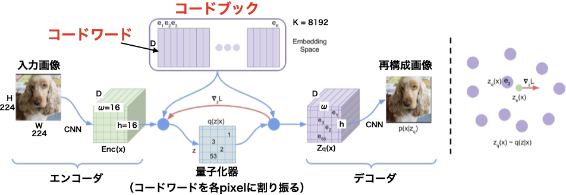
本節では、まずVQ-VAEからの離散表現学習について簡単に説明し、次に知覚コードブックの学習方法、そして学習した知覚視覚トークンに対するBERT事前学習というプロセスを紹介します。

### 映像コンテンツのための学習型離散コードブック
VQ-VAE[51]を利用して、連続画像内容を離散トークンの形に変換します。
画像 $ x\in \mathbb{R}^{H\times W\times 3} $ を考えると、VQ-VAEはそれを離散的な視覚コードワード $\{z^1_q, z^2_q, ...,z^N_q\} \in V^1 \times V^2 \times ...  \times V^N$ で表現することができます。
ここで、$z^i_q$は$K_i$個のD次元コードワードからなる視覚コードブック（語彙）$V^i = \{e^i_k \in \mathbb{R}^D \}^{K_i}_{k=1}$からなります。
通常、 $K_1 = K_2 = ... = K_N = K$ とし、$N = h \times \omega$（$h \times \omega$は潜在空間の空間分解能）です。

具体的には、VQ-VAEはエンコーダ、量子化器、デコーダの3つの主要な部分からなります。
エンコーダは、入力画像を中間潜在ベクトル$z＝ \mathrm{Enc}(x)$に写像し、$z\in \mathbb{R}^{h\times \omega\times D}$とします。
量子化器は、位置$(i,j)$の各ベクトルを、最近傍探索$k＝1$符号に従って対応するコードブック$V^{i, j} ＝\{e^{i, j}_k\}^K_{k=1} ⊂ \mathbb{R}^D$からなるコードワードに量子化する役割を担います。
すなわち

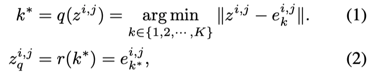

ここで、$q$はベクトルをコードブックのインデックスに対応付ける量子化エンコーダ、$r$はインデックスからベクトルを再構成する量子化デコーダです。
量子化されたコードワード$z_q$に基づき、デコーダは元画像$x$の再構成を目指します。
再構成結果は$\hat{x} = \mathrm{Dec}(z_q)$であるとします。
量子化器は微分不可能なので、勾配をエンコーダに逆伝播するために、勾配はストレートスルー推定器[3]のように近似され、デコーダからエンコーダへコピーされるだけです[51]。
VQ-VAEの学習目標は次のように定義されます。

### 映像コンテンツに対する知覚コードブックの学習
VQ-VAEでは、コードブックは、入力画像と再構成画像の間の要素ごとの画素損失、すなわち$L_{pixel}$によって学習されます。
しかし、この画素単位の損失は、個々の画素の正しさしか考慮しないため、ネットワークが知覚的な違いを捉えることができない可能性があります。
コードブックはこのような画素単位の損失で学習されるため、コードワードはおそらく知覚情報を符号化することに失敗します。

そこで、画素の損失を超えて元画像と再構成画像の間に知覚的な類似性を強制するというシンプルな戦略を提案します。
この知覚的類似性は、画素の差分ではなく、事前に学習したDNNから抽出した高レベルの画像特徴表現の差分に基づくものです。
この特徴的な損失が知覚的な違いをよりよく捉え、低レベルの変動に対して不変性を提供することを期待しています。
Fig.1では、画像再構成の観点から、異なる損失を使用した場合の比較を示しており、ピクセル単位の損失が低い画像は知覚的に似ていないように見える可能性があることを示唆しています。

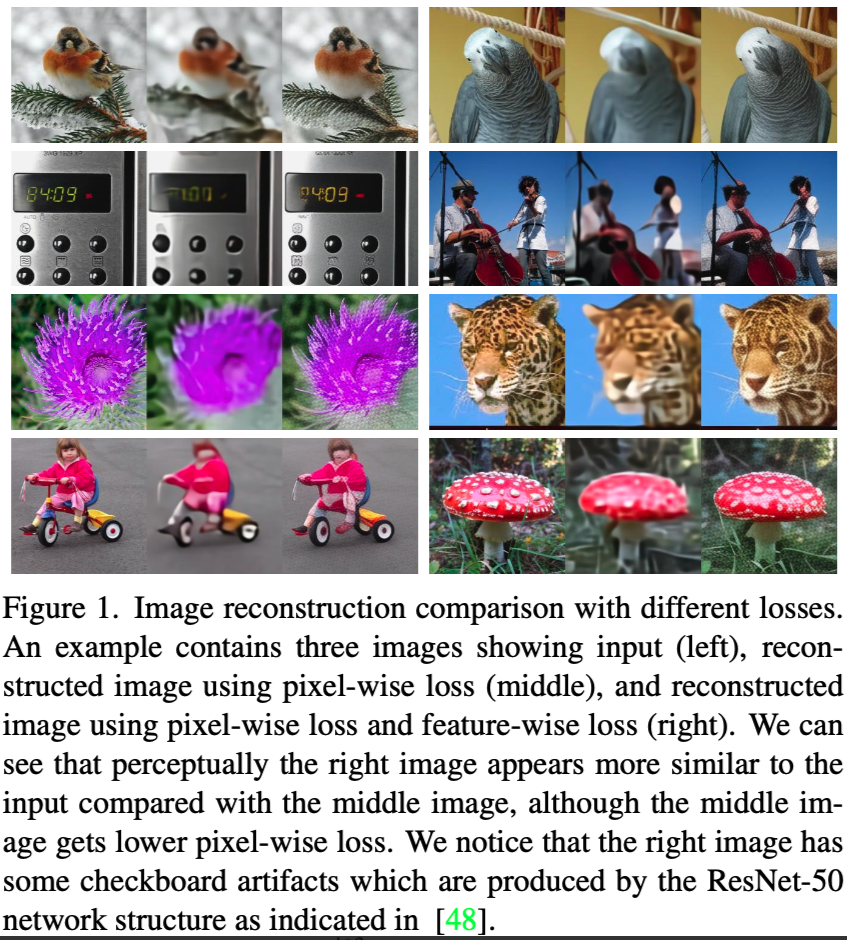

形式的には、画像$x$を処理するときのネットワーク$F$の$l$番目の層の正規化された活性度を$f_l(x)$とします。
特徴マップの大きさは、$H_l \times W_l \times C_l$であり、$H_l$は高さ、$W_l$は幅、$C_l$はチャネルの次元です。
通常、異なる深さの複数の層から、より包括的で識別性の高いマルチスケール特徴を抽出し、より良い意味的捕捉のための知覚的類似度を計算します。
元画像$x$と再構成画像$\hat{x}$の知覚的指標は以下のように定式化できます。

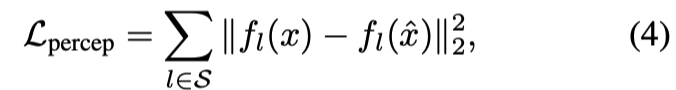

ここで、$S$は特徴を抽出する層の数を表します。
したがって、全体の目的関数は

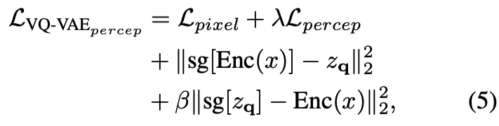

ここで、$\lambda$は$L_{percep}$の損失重みに関するハイパーパラメータであり、実験では損失重み$\lambda$の異なる値を検討することになります。

### BERT Objective over Perceptual Codebook
BEiT[2]と同様に、離散的な視覚的トークンに対するマスク画像モデリングタスクを実行するために、BERT Objectiveを採用します。
与えられた画像$x$に対して、入力トークンは画像全体から非重複に分割された画像パッチであり、出力トークンは式5の学習により得られた離散的な知覚的視覚単語です。
入力を$\{x_1, x_2, ..., x_N \}$、基底真理出力を$\{z_q^1, z_q^2, ..., z_q^N \} = r(q(\mathrm{Enc}(x)))$とします。
マスク画像モデリングの目的は、入力トークンの一部がマスクされた入力から、対応する視覚的トークンを復元することです。

正確には、マスクされたインデックスの集合を$M$とする。
すると、マスクされた入力$\bar{x}$は次のように表される。

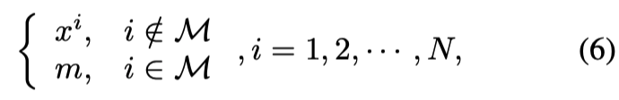

ここで、$m$は非マスクトークンと同じ次元の学習可能なマスクトークンです。
マスクされた入力トークンは、最後の層の隠れ出力を$\{h_1, h_2, ..., h_N\}$とする$L$層視覚変換器に供給されます。
マスクされた位置の隠れベクトルから対応する視覚的トークンを回復することを目的とします。
分類損失を用いてこれを達成するために、隠れベクトル$h_i$の後に$K-way$分類器を付加し、対応するコードブック$V^i$内の全ての可能な離散トークンに関する確率推定を得ます。
マスクされたパッチに対応する真実の離散視覚トークンが$t \in M$の$z_q^t$であるとすると、事前学習の目的は以下のように定式化できます。

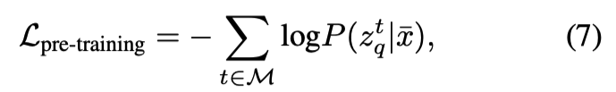

ここで、$P (z_q^t | x)$は、破損画像$\bar{x}$のマスクされたパッチに対するターゲットトークン確率の推定値です。
モデルを事前学習した後、ImageNet-1K [19] 分類、COCOオブジェクト検出 [42]、ADE20k [73] Segmentationなどの様々な下流タスクにモデルを適用します。

### 事前学習の詳細
#### ベクトル量子化器
ベクトル量子化には標準的なk-meansアルゴリズムを使用します。
コードブックのサイズ$K$を8192とし、公平に比較します。
離散潜像空間のサイズ$K$が大きい場合、画像を表現するためにいくつかのコードワードのみが選択され、学習されることが観察されます。
他の多くのコードワードは無駄になってしまいます。
この問題を克服するために、コードブック内のコードワードの利用率を高めるために有効であることが証明されている指数移動平均（EMA）[51]をコードブックの更新に採用します。

#### 知覚的コードブック学習設定
知覚コードブックの学習は、デフォルトでImageNet-1kデータセットの学習セットを用いて行います。
VQ-VAEのエンコーダとデコーダには、伝統的な畳み込みベースのバックボーンを選択します。
このネットワークには、各解像度における2つの残差ブロックと、解像度変更のためのダウンサンプル層とアップサンプル層が含まれています。
エンコーダ、デコーダともに最小の解像度にself-Attentionブロックを適用します。
知覚指標の計算には、デフォルトで自己教師あり手法MoCo v3[16]の事前学習100エポックViT-Bモデルを用い、知覚損失の計算には第3、第6、第9、第12層を選択します。
また、ResNet50[34]モデルを適用し、各ステージの最後に知覚的類似度を計算します。
知覚的損失の重み$\lambda$は、特に注意することなく1に設定しました。
知覚的なメトリックを計算するためのより多くの異なるモデルは、実験のセクションで提供されます。
入力画像サイズは$224\times224$であり、これは事前学習画像の入力サイズと一致している、潜在的なコードは$16\times16$の解像度です。
デフォルトの量子化アルゴリズムとして、EMAベクトル量子化器を用います。
学習率は$5e^{-5}$とし、バッチサイズは128とします。
PeCoを100エポック学習し、最初の5000反復をウォームアップして学習プロセスを安定化させます。
Adam[38]オプティマイザを使用し、$\beta_1$と$\beta_2$はそれぞれ0.5と0.95に設定されます。

#### BERT Pre-training Setup
計算資源を考慮し、BEiT[2]と同様に、学習した視覚コードブックの有効性を検証するために、オリジナルのViT-B/16[23]をバックボーンの基本アーキテクチャとして使用しました。
モデルはバッチサイズ2048で300/800エポックの事前学習を行っています。
学習率、$\beta_1$、$\beta_2$、重み減衰をそれぞれ$1.5e^{-3}$、0.9、0.999、0.05とし、AdamWオプティマイザを採用します。
また、BEiT[2]と同じ設定で、0.1$\%$の確率的深度[35]とブロックワイズマスキング戦略を適用し、破損画像を得ます。

## 結果
### 先行研究との比較
#### 画像分類
ImageNet-1Kの分類におけるTop-1精度を表1に示します。
本手法を、
1) ランダムな初期化でゼロから教師あり学習を行ったViT [23], DeiT [60],
2) 従来の最先端の自己教師あり学習法であるMoCo v3 [16], DINO [8], BEiT [2], 
3) 同時研究MAE [31] と比較する。
本モデル（PeCo）は、ゼロから学習したモデルと比較して大幅に性能が向上しており、事前学習の有効性が示唆されていることが分かります。
また、先行する自己教師あり事前学習モデルのbase-sizeと比較すると、PeCoが最も良い性能を達成していることがわかります。

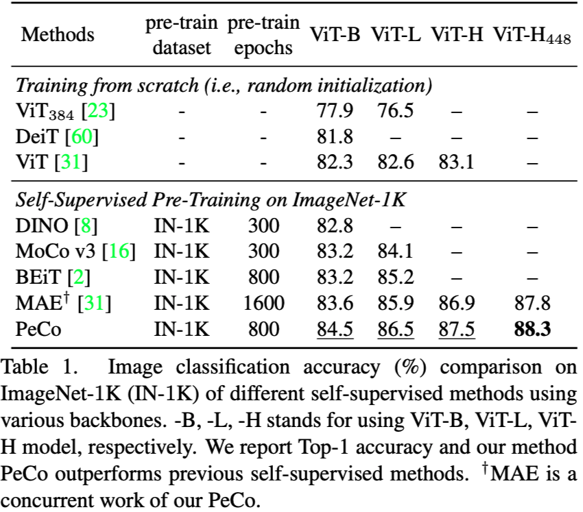

#### セマンティックセグメンテーション
本手法は、
1) ImageNet-1Kにおける教師あり事前学習、
2) 最先端の自己教師あり学習モデルであるBEiT [2]
と比較されます。
評価指標は、全ての意味カテゴリで平均化したmean Intersection of Union (mIoU)です。
結果は表3に示す通りです。

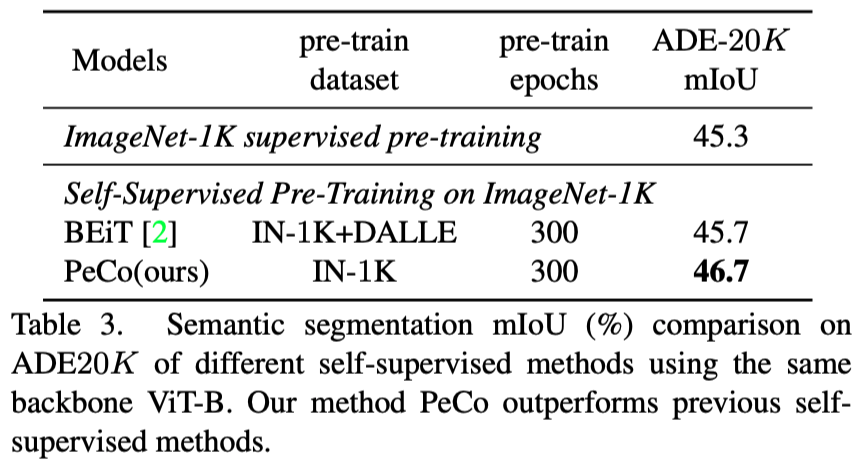

#### オブジェクトの検出とセグメンテーション
このデータセットについて、強力な競合であるBEiT[2]と比較します。
評価指標は、検出ではボックスAP、セグメンテーションではマスクAPです。
比較は表4に示します。

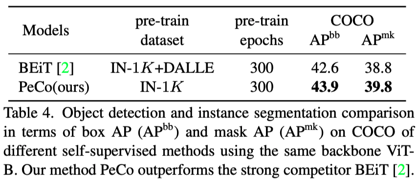

### 知覚的コードブックの分析
#### Semantics of the Codewords
最も重要な疑問は、学習された知覚的コードワードは（より）意味的な意味を持つのだろうか、ということです。
これに答えるため、視覚的な結果と定量的な結果の両方が得られるような実験を計画しました。

まず、同じコードワードに対応する画像パッチを可視化します。
このような画像パッチは、同じ特定の意味合いを示すと推測されます。
2つのベースラインと比較します。
(1) 約250Mのプライベートデータで学習したDALL-E [56] コードブックと、
(2) 知覚的類似性を用いない本モデルのバリエーション
です。
ImageNet検証セットの画像からコードワードのコレクションを取得する。
そして、コードワードをランダムに選択し、そのコードワードと相関のあるパッチを元画像から切り出す。
その結果をFig.3に示します。
ベースラインからのコードが低レベルの情報（例えば、テクスチャ、色、エッジ）と相関していることが多いのに対し、本コードは、例えば、図に示す鶏冠や車輪のように意味的な意味と強く関連していることが分かります。

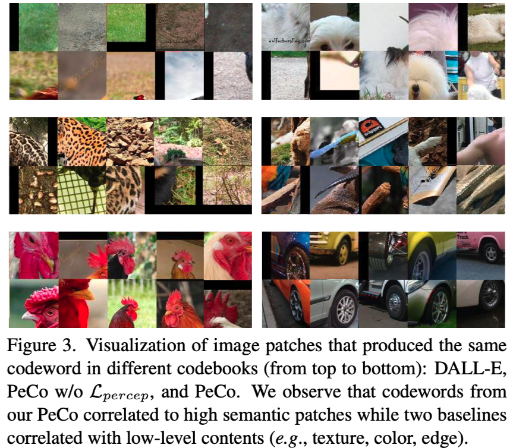

第二に、コードワードの意味性を2つの側面から定量的に評価します。
(1) 画像のコードワードを分類のための特徴量として利用する。画像中の量子化されたコードワードに対して平均プーリングを行い、ImageNetデータセットに対する線形プロービングの精度を検証する。
(2) ImageNet-1K 教師あり事前学習済みDeiTT [60]（クリーンなImageNet valセットで72.2$\%$のTop1精度）を用いて、再構成画像に対する分類精度をテストする。
知覚的類似性を使用しないバリエーションと比較します。
その結果を表5に示します。
その結果、コードワードの線形評価と再構成画像の分類の両方で、本知覚的コードワードの方がはるかに高い精度を得ていることが分かりました。
これは、本知覚的コードブックがより意味的な意味を持ち、画像再構成処理に有効であることを示している。
また、Fig.2にBEiT[2]とPeCoを用いたマスク領域予測の可視化を示します。
PeCoは、知覚的コードブックを用いて、マスク領域に対してより意味的な予測を行うことができることを示しています。

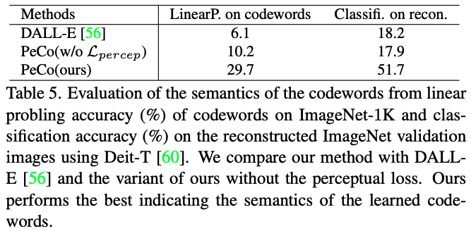

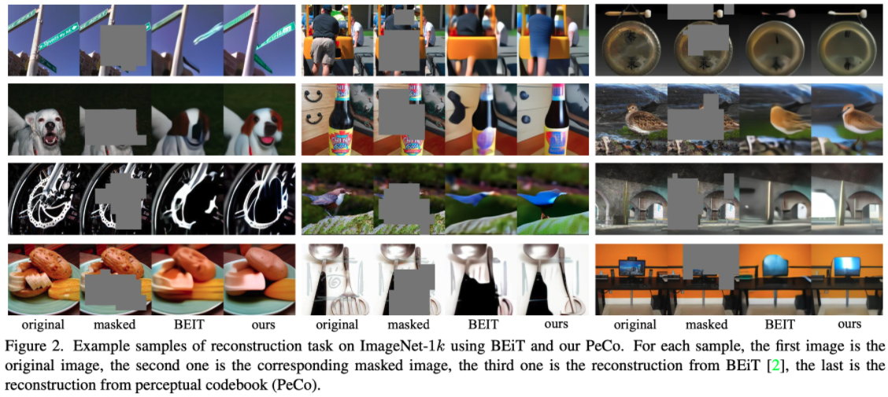

#### 知覚的類似性のための深層アーキテクチャ
もう一つの重要な疑問は、知覚的類似度を計算するために特徴量を抽出する深層アーキテクチャは、知覚的コードブック学習に影響を与え、結果として事前学習性能に影響を与えるのだろうか、ということです。
そこで、2つの異なる深層アーキテクチャ、畳み込みベースのバックボーンResNet50 [34]とTransformerベースのモデルViT-B [23]を調査します。
本コードブックは事前学習のために設計されているため、ラベルのないデータセットに対する事前学習を可能にするために、自己教師ありモデルを研究します。
その結果を表6に示します。

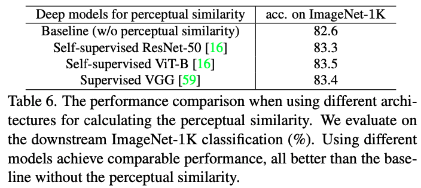

本シナリオでは、畳み込みベースのネットワークやトランスフォーマーベースのネットワークを使用しても、同様の性能を達成できることが分かります。
さらに、古典的な教師あり（すなわち、ラベルを使用する）学習VGG [59]を用いた場合、自己教師ありモデルと同等の性能を達成できることが分かります。

#### 知覚コードブックの学習データセットの効果
PeCoの強みは、VQ-VAEの学習に128万画像のImageNet-1Kのみを使用することです。
これは、インターネット上の2億5000万枚の画像をVQ-VAEの学習に使用するDALL-Eと比較して、非常に高い学習効率となります。
さらに、これを検証するために、デフォルト設定に従って、14M画像からなるImageNet-22Kデータセット上で知覚コードブックを訓練します。
BERTの事前学習は、やはりImageNet-1Kで実施します。
表7に転送性能を示します。
より多くのデータで知覚コードブックを訓練することは、次のBERT事前訓練に役立たないようであることが分かります。
これは、データセットのスケールアップではなく、より良い知覚コードブックの設計にのみ集中すればよいことを示す結果となっています。

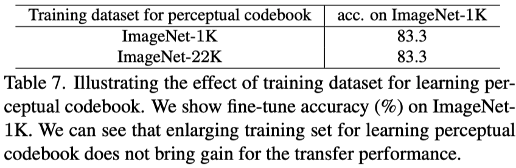

## 結論
画像と言語の違いは常に議論されており、近年多くの注目を浴びています。
画像の自然な表現が意味的な分解ではないという観察に基づき、視覚変換器のBERT事前学習に有益な、知覚的に離散的なトークンを得るためのシンプルかつ効果的な戦略を提案しました。
様々な下流タスクに関する広範な比較を行い、その結果は、画像をトークンに離散化するだけでは不十分であり、視覚的トークンの知覚レベルも重要であることを実際に示していました。
